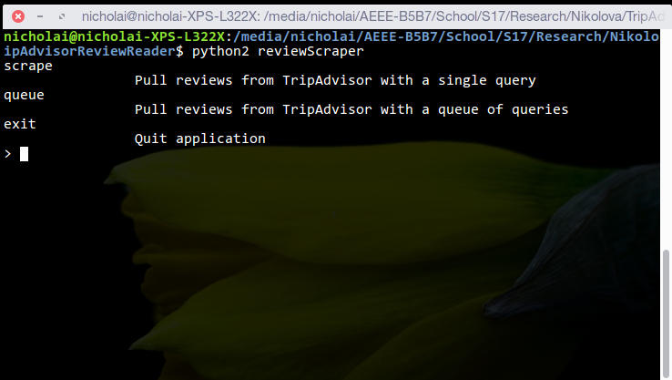
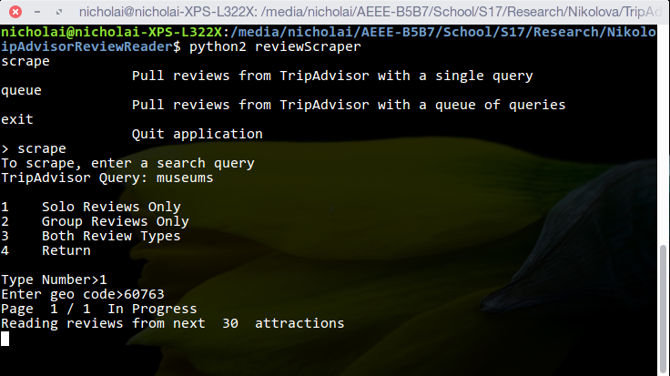
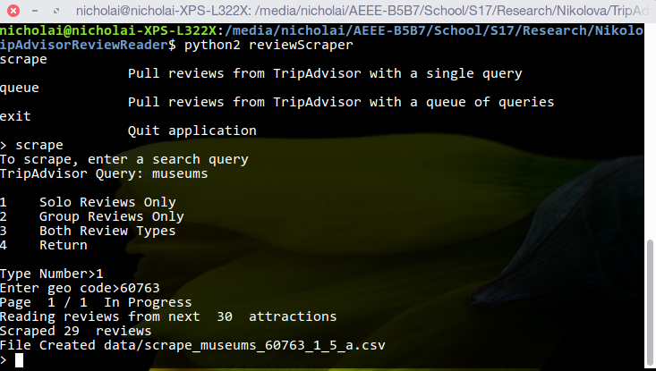
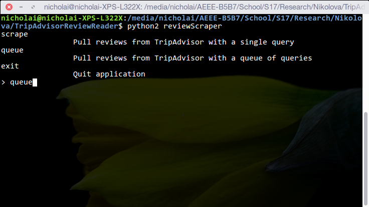
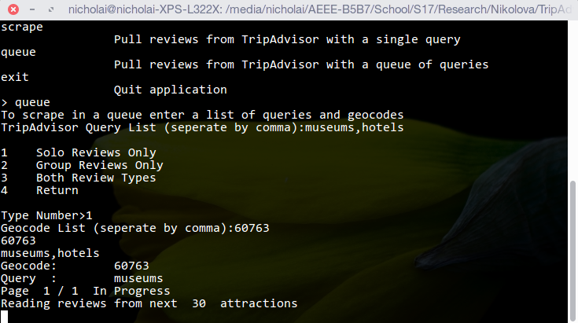

# TripAdvisorReviewReader

Scrape reviews from [tripadvisor.com](tripadvisor.com) based on a search query. A good way to scrape data from research and data mining purposes. It quickly and accurately pulls review information and saves it in either csv or json format.

##  Installation

### Linux/Mac
```BASH
$ python2 pip install pyquery requests unicodecsv
$ git clone https://github.com/nickmitchko/TripAdvisorReviewReader.git
```

### Windows
1. Install Python 2.7
2. Install PIP by [reading here](http://stackoverflow.com/a/12476379)
3. Run these commands
```BAT
> C:\Python27\Scripts\pip.exe install pyquery requests unicodecsv
> git clone https://github.com/nickmitchko/TripAdvisorReviewReader.git
```

## Running

### Linux/Mac

```BAT
$ python2 TripAdvisorReviewReader\reviewScraper
```

###Windows

* Double-click run.cmd
*--- OR ---*
```BAT
> C:\python27\python.exe TripAdvisorReviewReader\reviewScraper
 ```
 
## How to use
1. Choose an option, there are only three
2. Choose a review type
3. Choose a location to search


#### Scrape Example
Query: museums
Geocode: 60763 (New York City)




#### Scrape Example



## Options

* scrape: pulls the reviews from a location and query
* queue: pulls the reviews from multiple locations and queries

## Geocodes

A geocode is an internal number used by tripadvisor to identify locations. They are pivotal in using this application.
 
#### Finding Geocodes

1. Search for a location on tripadvisor.com

2. Look at the URL to find the geocode
